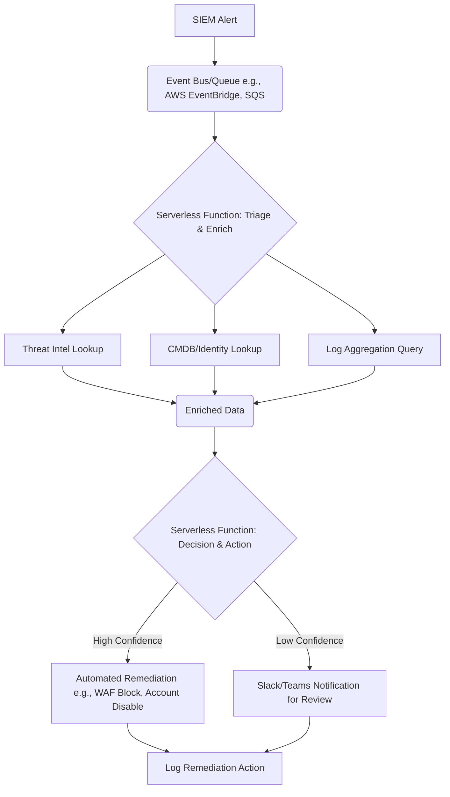

## Automating Incident Response: From Manual Drudgery to Serverless Savvy

Incident response (IR) is often a high-stakes, high-stress endeavor. When an alert fires, every second counts. Manual steps, context switching, and human error can compound the problem, extending downtime and increasing the blast radius. What if we could automate the initial triage, enrichment, and even some remediation steps, freeing up our engineers to focus on the truly complex problems?

This is where serverless functions and event-driven architectures shine. By reacting to security events in real-time with lightweight, purpose-built code, we can drastically reduce mean time to acknowledge (MTTA) and mean time to resolve (MTTR), making our IR processes more efficient and less prone to human fatigue.

Let's explore how we can build a practical, automated IR pipeline using serverless functions.

### The Problem with Manual Triage

Imagine a typical scenario:
1.  **Alert:** A security information and event management (SIEM) system detects unusual activity – say, multiple failed login attempts against an administrative account from an unfamiliar IP address.
2.  **Notification:** An on-call engineer receives a PagerDuty alert.
3.  **Context Gathering:** The engineer logs into the SIEM, searches for related logs, checks the IP address against threat intelligence feeds, looks up the account in Active Directory, and verifies recent login history.
4.  **Action:** Based on the gathered information, they decide whether to block the IP, disable the account, or escalate.

This process, while necessary, is repetitive and time-consuming. Each step can be a bottleneck, especially during off-hours or high-volume incidents.

### Event-Driven IR with Serverless Functions

The core idea is to react to an *event* (the SIEM alert) by triggering a *function* that performs automated *actions*.

Here's a simplified architecture:



Let's break down the components and how they work together.

### Step 1: Ingesting the Alert

Your SIEM is the source of truth for security events. Most modern SIEMs (Splunk, Elastic, CrowdStrike Falcon, etc.) offer integration points:
*   **Webhooks:** Directly call an API Gateway endpoint.
*   **Cloud-specific integrations:** AWS Security Hub, Azure Sentinel, GCP Security Command Center can often trigger events directly into their respective cloud's event bus.
*   **Log Forwarding:** Forward specific alert logs to a cloud logging service (e.g., CloudWatch Logs, Azure Monitor Logs) which can then trigger functions.

For this example, let's assume our SIEM can send a webhook to an AWS API Gateway endpoint, which then puts the event onto an SQS queue for asynchronous processing. This decouples the SIEM from our processing logic and provides a buffer.

```json
// Example SIEM Alert Payload (simplified)
{
  "alertId": "SIEM-12345",
  "ruleName": "Multiple Failed Logins from New IP",
  "severity": "High",
  "sourceIp": "192.0.2.100",
  "targetUser": "admin_account_prod",
  "timestamp": "2023-10-27T10:30:00Z",
  "eventLink": "https://siem.example.com/alerts/SIEM-12345"
}
```

### Step 2: Triage and Enrichment Function (AWS Lambda Example)

Our first Lambda function, let's call it `IR_TriageAndEnrich`, is triggered by messages in the SQS queue. Its job is to gather all relevant context.

**Purpose:**
*   Parse the incoming alert.
*   Perform threat intelligence lookups for the `sourceIp`.
*   Query our CMDB or identity provider (e.g., Okta, Azure AD, LDAP) for information about `targetUser`.
*   Search for other related logs (e.g., all activity from `sourceIp` or `targetUser` in the last hour).

**Example Python Lambda Code Snippet:**

```python
import os
import json
import boto3
import requests

# Environment variables for API keys and endpoints
THREAT_INTEL_API_KEY = os.environ.get("THREAT_INTEL_API_KEY")
CMDB_API_ENDPOINT = os.environ.get("CMDB_API_ENDPOINT")
LOG_ANALYTICS_ENDPOINT = os.environ.get("LOG_ANALYTICS_ENDPOINT") # e.g., Splunk HEC, CloudWatch Logs Insights
NEXT_STEP_SQS_QUEUE_URL = os.environ.get("NEXT_STEP_SQS_QUEUE_URL")

sqs_client = boto3.client("sqs")

def lambda_handler(event, context):
    for record in event['Records']:
        body = json.loads(record['body'])
        alert_payload = json.loads(body['Message']) # Assuming SIEM sends JSON string in 'Message'

        source_ip = alert_payload.get("sourceIp")
        target_user = alert_payload.get("targetUser")
        alert_id = alert_payload.get("alertId")

        enriched_data = {
            "alertId": alert_id,
            "originalAlert": alert_payload,
            "threatIntel": {},
            "userDetails": {},
            "relatedLogs": []
        }

        # 1. Threat Intelligence Lookup
        if source_ip:
            try:
                # Replace with your actual threat intel API call
                ti_response = requests.get(
                    f"https://api.threatintel.example.com/v1/ip/{source_ip}",
                    headers={"Authorization": f"Bearer {THREAT_INTEL_API_KEY}"}
                ).json()
                enriched_data["threatIntel"] = ti_response.get("data", {})
                # Example: Check if IP is known malicious
                if enriched_data["threatIntel"].get("is_malicious", False):
                    enriched_data["threatIntel"]["confidence"] = "High"
                else:
                    enriched_data["threatIntel"]["confidence"] = "Low"
            except Exception as e:
                print(f"Error during threat intel lookup for {source_ip}: {e}")

        # 2. CMDB/Identity Lookup
        if target_user:
            try:
                # Replace with your actual CMDB/Identity API call
                cmdb_response = requests.get(f"{CMDB_API_ENDPOINT}/users/{target_user}").json()
                enriched_data["userDetails"] = cmdb_response.get("data", {})
                # Example: Check if user is a critical admin
                if "admin" in enriched_data["userDetails"].get("roles", []):
                    enriched_data["userDetails"]["isCriticalAdmin"] = True
                else:
                    enriched_data["userDetails"]["isCriticalAdmin"] = False
            except Exception as e:
                print(f"Error during CMDB lookup for {target_user}: {e}")

        # 3. Related Log Search (simplified example)
        # In a real scenario, this would involve calling your log aggregation API
        # e.g., Splunk HEC with a search query, CloudWatch Logs Insights query
        try:
            # Simulate a log search
            simulated_logs = [
                {"timestamp": "...", "message": f"Login attempt for {target_user} from {source_ip}"},
                {"timestamp": "...", "message": f"Failed login for {target_user}"}
            ]
            enriched_data["relatedLogs"] = simulated_logs
            if any("successful" in log["message"].lower() for log in simulated_logs):
                 enriched_data["relatedLogsCount"] = len(simulated_logs)
                 enriched_data["hasSuccessfulLogins"] = True
            else:
                 enriched_data["hasSuccessfulLogins"] = False

        except Exception as e:
            print(f"Error during log search: {e}")

        # Publish enriched data to the next SQS queue for decision-making
        sqs_client.send_message(
            QueueUrl=NEXT_STEP_SQS_QUEUE_URL,
            MessageBody=json.dumps(enriched_data)
        )

    return {"statusCode": 200}
```

**Key Takeaways from `IR_TriageAndEnrich`:**
*   **Idempotency:** Consider how to handle duplicate events if your SQS queue has a long visibility timeout or your function retries.
*   **Error Handling:** Robust `try-except` blocks are crucial for external API calls.
*   **Environment Variables:** Use them for sensitive data (API keys) and configuration (endpoints).
*   **Next Step:** The enriched data is pushed to another SQS queue, allowing for further processing by a separate function. This promotes modularity and resilience.

### Step 3: Decision and Action Function (AWS Lambda Example)

The `IR_DecisionAndAction` Lambda function is triggered by messages from the `NEXT_STEP_SQS_QUEUE`. Its role is to evaluate the enriched data and decide on the appropriate automated response.

**Purpose:**
*   Analyze the `threatIntel`, `userDetails`, and `relatedLogs` fields.
*   Apply predefined rules to determine confidence in the incident and the required action.
*   Perform automated remediation steps (e.g., WAF block, account disable) for high-confidence incidents.
*   Send notifications (e.g., Slack, PagerDuty) for review or low-confidence incidents.

**Example Python Lambda Code Snippet:**

```python
import os
import json
import boto3
import requests

# Environment variables for API keys and endpoints
SLACK_WEBHOOK_URL = os.environ.get("SLACK_WEBHOOK_URL")
WAF_API_ENDPOINT = os.environ.get("WAF_API_ENDPOINT") # e.g., AWS WAF, Cloudflare API
IDENTITY_API_ENDPOINT = os.environ.get("IDENTITY_API_ENDPOINT") # e.g., Okta, Azure AD Graph API

def lambda_handler(event, context):
    for record in event['Records']:
        enriched_data = json.loads(record['body'])
        
        source_ip = enriched_data["originalAlert"].get("sourceIp")
        target_user = enriched_data["originalAlert"].get("targetUser")
